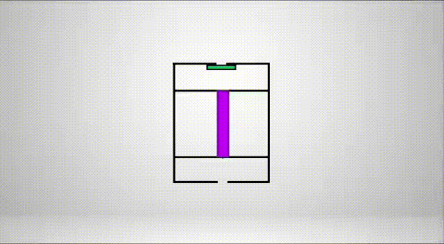
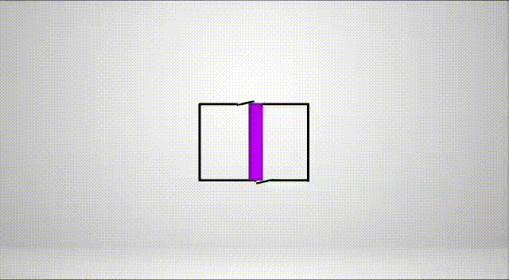

## MODULAIR PURIFYING SYSTEM - THE BEST SOLUTION FOR YOU. EVERYWHERE.

Differently from regular purifying systems, the team seeks cost reduction by using more economic assembly material with an efficient filtration mechanism, which takes into consideration the difficulties at eliminating virus and bacteria from indoor air. The solution proposed consists in an Air Purifier using UV-C Technology integrated with HEPA filtering process.When facing a challenge of this magnitude, the possibility of providing helping methods to the community is extremely important, as the solution is able to impact a wide range of the population.

Merging a conventional filtration mechanism with UV-C radiation technology, based on Nasa’s own Airocide product, enables our solution to provide a better air quality at indoor ambients at lower costs, making a positive impact in the lives of individuals in vulnerable conditions. The project puts together two technologies in a cheaper and more accessible structure, making its validation faster and simpler. Even though all the components exist already, the innovation comes in the way they are utilized and in the development of new support structures, adapting the product for different environments.

The operation principal is simple: A compressor pulls air inside of the chamber. This air is initally filtered through a physical filter. After that, this air will be displaced based in a flap mechanism, going into one of the two chamber. Inside the chamber, an UV-C Light is responsible for filtering Virus and Bacteria for 15 seconds, seeking a complete filtering. Once the filtering time ends, the chamber a flap allows the air to go back to the ambient, but, simultaneously, the other chambers restarts the filtering process with dirty air. 

### PROBLEM
High Levels of pollution in large urban centers are not new information. NASA’s Air Quality Group has been collecting data showing how NO2 concentration decreased recently and this changes are driven by alteration in human behavior as a response to evolving restrictions during the COVID-19 pandemic.

This drastic measures such as lockdown taken by countries worldwide to contain the spread of COVID-19 have influenced air pollution dynamics substantially, at a planetary scale. The most effective prevention tool implemented in many countries is home isolation for both healthy and infected individuals with mild symptoms. Isolation for protection from COVID-19 might be effective, but unfortunately, isolation with improper ventilation could lead to other health problems,such as irritation, physical symptoms, respiratory and heart diseases, and cancer. 
***Images took from https://airquality.gsfc.nasa.gov/no2/world***

People stay indoors for about 93% of their time and this may increase to 100% for some in the current situation, which increases their rate of exposure to poor Indoor Air Quality. Indoor concentration of some contaminants are sometimes 2-5 times their relative outdoor concentration. Home isolation due to coronavirus might protect us from this virus, but poor ventilation due to the fear of contracting COVID-19 might lead to other health problems. An air purifier can be a good outlet for this issue, but most of the population does not have enough budget to afford such a device due to high level prices. Furthermore, most of this equipment is not adaptable to the environment, requiring a room redesign to have a full efficiency at purifying the air. 

### SOLUTION
Merging a conventional filtration mechanism with UV-C radiation technology, based on Nasa’s own Airocide product, enables our solution to provide a better air quality at indoor ambients at lower costs, making a positive impact in the lives of individuals in vulnerable conditions. The project puts together two technologies in a cheaper and more accessible structure, making its validation faster and simpler. Even though all the components exist already, the innovation comes in the way they are utilized and in the development of new support structures, adapting the product for different environments.

### PROJECT DEVELOPMENT 

Coming from a different background of usual Hackathon teams, ours consists mainly of mechanical and electrical engineers, so, the choice of challenge was purifying air, which enables us to build a prototype instead of creating an app. 
The main focus of the solution is to help the society to live better through the improvement of air quality, both during this time of the COVID-19 pandemic and beyond. After discarding outdated options, inspired by Nasa's purifying technologies, ModulAir was the chosen concept based on its viability and the potential to make a positive impact on people’s lives. 
The availability of numerous articles about air purifying, both on space and on Earth, was essential to provide a better comprehension about the different processes. Based on the provided articles and data about air quality the team was able to elaborate and later improve our solution constantly.
To develop a prototype during this digital Hackathon, while not being able to physically interact with the other team members, the softwares of choice were SolidWorks and Tinkercad, the first to emulate a 3D product and the second to validate the Arduino control system.

### ELECTRONIC SIMULATION AND PROGRAMMING 

### CREW MEMBERS 

### REFERENCES

NATIONAL AERONAUTICS AND SPACE ADMINISTRATION. Life Support Systems. 2017. Sustaining Humans Beyond Earth. Disponível em: https://www.nasa.gov/content/life-support-systems. Acesso em: 30 maio 2020.

SCHNEIDER, Jonny. The Double Diamond: strategy + execution of the right solution. Strategy + Execution of the Right Solution. 2015. Disponível em: https://www.thoughtworks.com/insights/blog/double-diamond. Acesso em: 30 maio 2020.

NATIONAL AERONAUTICS AND SPACE ADMINISTRATION. Health and Air Quality Data Pathfinder. EARTHDATA. Disponível em: https://earthdata.nasa.gov/learn/pathfinders/health-and-air-quality-data-pathfinder. Acesso em: 30 maio 2020.

NATIONAL AERONAUTICS AND SPACE ADMINISTRATION. Clearing the Air in Space: improving life support on international space station and for deep space exploration. Improving Life Support on International Space Station and For Deep Space Exploration. 2016. Disponível em: https://www.nasa.gov/mission_pages/station/research/long_duration_sorbent_testbed. Acesso em: 30 maio 2020.

International Space Station: air purification. Air Purification. 2011. Disponível em: https://www.nasa.gov/mission_pages/station/research/advasc.html. Acesso em: 30 maio 2020.

Shrestha, Asheshwor & Sharma, Roshan & Bhattarai, Suraj & Tran, Hanh & Rupakheti, Maheswar. (2020). Lockdown caused by COVID-19 pandemic reduces air pollution in cities worldwide. 10.31223/osf.io/edt4j.
